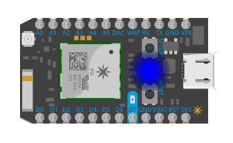
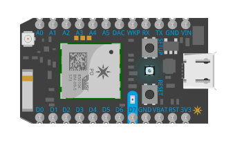
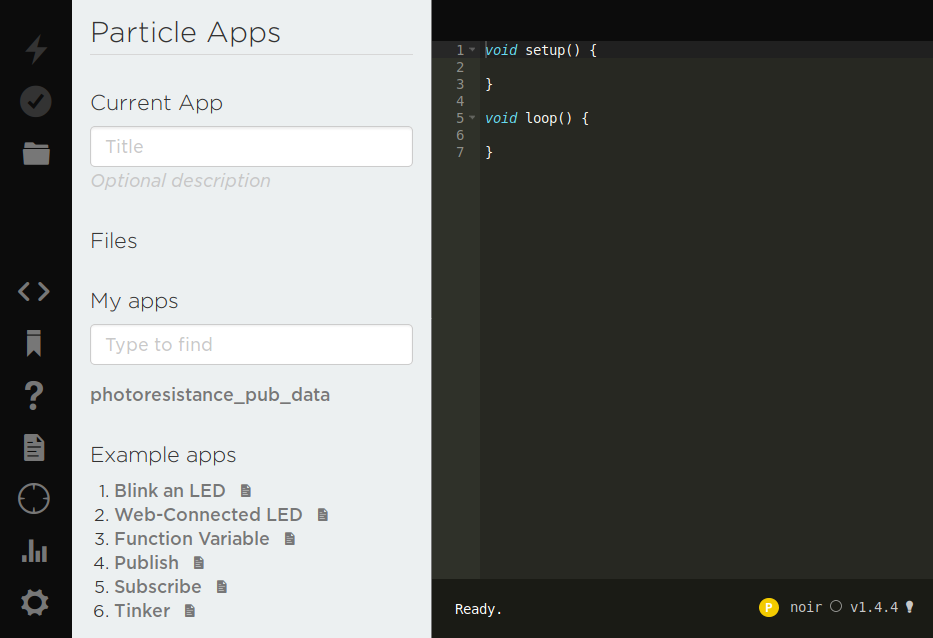
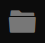
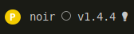
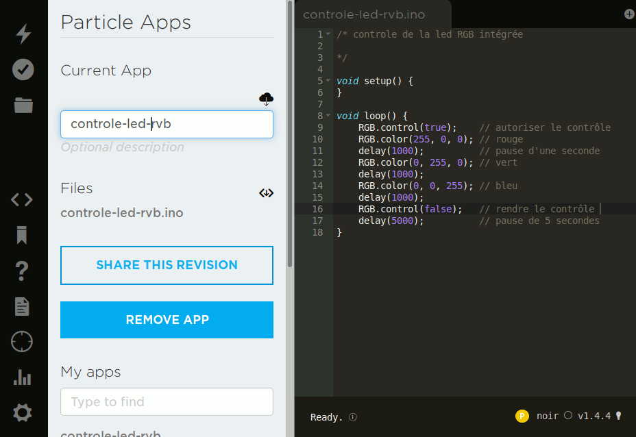
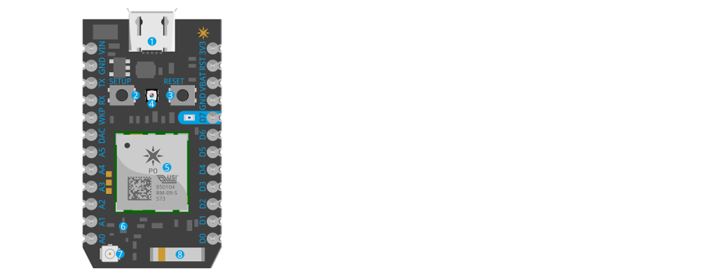

# Introduction au Photon

**(en cours de rédaction mai/juin 2020)**

# 💅 .

## Introduction

«Photon», c'est une carte électronique facilement programmable pour tester des prototypes d'objets interactifs connectés. Les Photons sont capables d'envoyer et de recevoir des données en wifi. On peut les utiliser dans le cadre d'un réseau local, ou les connecter à internet, au cloud.

Connectés à internet, il devient possible de :
* programmer la carte à distance,
* déclencher des actions à distance (ex : allumer un appareil, choisir la couleur d'une lampe),
* recevoir, stocker, afficher des données produites par une carte Photon et un/plusieurs capteur(s) associé(s) (ex: données météo)

En plus de la carte électronique, moyennant la création d'un compte, Particle (fabricant) donne l'accès à un cloud, à un environnement de programmation dans le navigateur (IDE), à diverses applications et à une documentation très complète.


### Quel rapport entre Arduino et Photon


Ce sont deux variantes de cartes programmables, pratiques pour créer des prototypes, avec une documentation et des tutoriels adaptés pour l'apprentissage. Le projet Arduino est principalement orienté sur l'électronique interactive, alors que Photon est consacré à la découverte des principes de «l'internet des objets» (communication sans fil, cloud, wifi).

La carte Photon se programme sans fil (ce qui permet aussi de la programmer sans être dans le même lieu!), alors qu'en général l'Arduino se programme par une connexion USB-série. Le code qui permet de programmer la carte Photon est similaire à celui utilisé sur Arduino, il est donc possible de passer très rapidement d'une carte à l'autre, selon les besoins.

Pour la partie électronique, le microcontrôleur (= «le cerveau de la carte» qui équipe l'arduino fait partie de la série ATMega 8bits de Microchip, alors que le Photon est équipé d'un microcontrôleur ARM Cortex M3 32bits, plus puissant ainsi que d'un circuit spécialisé pour la partie wifi (TODO voir plus loin pour des explications précises).


### Pré-requis


Cette introduction à Photon requiert que vous soyez déjà initié à l'électronique interactive :
* bases de l'électronique : résistance, tension, signal, masse, etc.
* programmation de carte électronique à microcontrôleur comme Arduino,
* principes d'entrée/sortie binaire (Digital In / Digital Out)
* principes d'entrée/sortie analogiques (Analog In / Analog Out)


### Qui produit les cartes Photon ?


C'est la société américaine [Particle](https://www.particle.io/) qui fabrique et vend les cartes Photon. Il s'agit de la 2e génération de circuits (photon, electron) qu'ils ont produit. Depuis, une 3e génération (argon, boron) est sortie permettant de mettre en place des réseaux maillés de capteurs (*wireless mesh network*). (TODO voir plus loin)


## Mise en pratique

(TODO)

### Comment ça fonctionne

#### Communication par le WIFI
(TODO)

#### Codes lumineux du Photon

La led RVB du Photon donne de précieuses indications sur son fonctionnement : est il connecté ? est-il en train de recevoir un nouveau programme ? Elle renseigne également sur les erreurs rencontrées.  

En détail : https://docs.particle.io/tutorials/device-os/led/photon/


###  Préparer son photon

Trois étapes sont nécessaires avant de commencer à programmer son Photon :
* se créer un compte Particle pour utiliser l'IDE en ligne et enregistrer ses programmes dans le cloud Particle,
* appairer le Photon concerné avec ce compte,
* inscrire les codes d'accès WIFI du réseau local dans le Photon.

#### Créer un compte particle

Pour se créer un compte : https://login.particle.io/signup (identifiant et mot de passe à conserver!)

#### Appairer le photon

Cette opération consiste à associer un Photon au compte Particle précédemment créé. Pour cela la méthode la plus simple est d'installer l'application Particle disponible pour [Android](https://play.google.com/store/apps/details?id=io.particle.android.app) ou [iPhone](https://itunes.apple.com/us/app/particle-build-iot-projects-wifi-or-cellular/id991459054?mt=8)


1. Relier le Photon à un port USB d'ordinateur. Une fois branché, la led du Photon clignote en bleu (mode d'écoute), signifiant qu'il ne peut pas se connecter au réseau WIFI, si ce n'est pas le cas : appuyer sur le petit bouton SETUP, à gauche de la LED.
2. Démarrer l'application et lancer la détection, [en suivant les étapes de cette vidéo](https://vimeo.com/178282058). L'application permet d'inscrire les codes d'accès WIFI du réseau local dans le Photon. Une fois configuré la led «respire» en bleu cyan, celui-ci pourra maintenant se connecter à internet sans nécessiter l'application.



Il est aussi possible de configurer un Photon pour la première fois en ligne de commande (voir la partie sur les outils CLI en annexe)

### Utiliser l'IDE en ligne

L'IDE est l'environnement de programmation du Photon, c'est un logiciel aux fonctions multiples qui s'exécute dans le navigateur.

On l'utilise pour :
* écrire de nouveaux programmes pour le Photon
* compiler ces programmes (et repérer d'éventuelles erreurs)
* transmettre ces programmes au Photon = le programmer
* stocker ses programmes dans un cloud personnel

**Pour se connecter à l'IDE : https://build.particle.io/**



A gauche: une colonne d'icônes permet d'accéder aux différentes actions.  
A droite : la zone ou écrire le code et tout en bas le nom du Photon, son état, et la version du *firmware* dans ce photon.  
Au centre la colonne se divise en trois parties : en haut, l'application en cours d'écriture ; au centre les applications personnelles ; en bas, les applications d'exemple fournies par Particle.

 Flasher l'application dans le Photon (= téléverser).  
 Compiler / rechercher les erreurs (= débuguer).  
 Enregistrer le code de l'application en cours.  
 Écrire le code l'application, charger une autre application.  
 Parcourir les bibliothèques (*libraries*) de code utilisables, et leurs exemples.  
 Consulter l'aide.  
 Consulter la documentation (référence des fonctions, schémas, etc.)  
 Afficher la liste des Photons associés à ce compte Particle.  
 Afficher la console cloud (messages envoyés par les Photons, journal d'activité, etc.)  
 Changement de mot de passe, réglages divers.  

 Identification et statut du Photon : ici on peut lire : le Photon actif s'appelle «noir», il n'est pas connecté au cloud, il est équipé d'une version du système v1.4.4. L'icône de petite ampoule permet de le faire clignoter à distance pour l'identifier s'il y en a plusieurs!  

### Tester son Photon avec un premier programme

Comme première application, nous allons contrôler la led RVB intégrée du Photon. La led RVB est utilisée par le système pour donner des informations sur son état et son fonctionnement, notre programme prendra le contrôle de la led pour changer sa couleur, puis abandonnera ce contrôle pour que le Photon puisse donner ces indications habituelles.

référence : [utiliser la led RVB](https://docs.particle.io/reference/device-os/firmware/photon/#rgb)

1.Créer une nouvelle application «controle-led-rvb»

2.Entrer le code suivant
```c++
/* controle de la led RGB intégrée
   https://docs.particle.io/reference/device-os/firmware/photon/#rgb
*/

void setup() {
}

void loop() {
    RGB.control(true);    // autoriser le contrôle de la led RVB
    RGB.color(255, 0, 0); // rouge
    delay(1000);          // pause d'une seconde (1000 millisecondes)
    RGB.color(0, 255, 0); // vert
    delay(1000);
    RGB.color(0, 0, 255); // bleu
    delay(1000);
    RGB.control(false);   // rendre le contrôle de la led RVB au système
    delay(5000);          // pause de 5 secondes
}
```

3.Enregistrer le programme dans votre cloud Particle personnel

4.Compiler pour vérifier qu'il n'y a pas d'erreurs de syntaxe (le cas échéant, elles apparaîtront sous la zone de code)

5.Flasher

La led change de couleur!



## Communication à distance

Le Photon permet de communiquer par le WIFI : par exemple pour envoyer des données captées ou pour recevoir des commandes et réaliser des actions.

Ces types de communication sont activées par des fonctions dans le code du programme.

Plusieurs exemples sont donnés dans ce chapitre pour explorer ces différents possibilités, mais commençons par passer en revue ces fonctions avant de les détailler ci-après :

**[Particle.function()](https://docs.particle.io/reference/device-os/firmware/photon/#particle-function-)** : ce type de fonction peut être déclenché par une requête POST venue d'un site web, par exemple : déclencher un éclairage depuis une interface web distante. Jusqu'à 15 fonctions peuvent être associées à un Photon.

**[Particle.variable()](https://docs.particle.io/reference/device-os/firmware/photon/#particle-variable-)** : variable exposée sur le cloud, dont on peut récupérer la valeur par une requête GET, par exemple : afficher la température recueillie par un capteur sur un site web distant. Jusqu'à 20 variables peuvent être utilisées par un Photon.

Ces variables et ces fonctions sont définies dans le setup() avec un identifiant, elles sont associées à une variable ou une fonction du programme.

**[Particle.publish()](https://docs.particle.io/reference/device-os/firmware/photon/#particle-publish-)** : chaque Photon peut publier des mini-messages qui sont envoyées sur le cloud avec une durée de vie de 60 secondes, on peut les voir comme des sortes de *tweets*, des services externes peuvent être déclenchés à partir de ces messages. (par exemple : un message publié quand la lumière est allumée déclenche l'envoi d'un SMS). Chaque Photon est limité à l'envoi d'un message par seconde.

Quelle différence entre Particle.variable() et Particle.publish() ?  
Particle.publish() «pousse» une variable sur le cloud, alors qu'il faut aller chercher la valeur de Particle.variable() par une requête.

**[Particle.subscribe()](https://docs.particle.io/reference/device-os/firmware/photon/#particle-subscribe-)** : un Photon peut être abonné aux messages publiés par un autre Photon, ce qui permet de les faire communiquer (par exemple : un mouvement détecté dans un lieu déclenche une installation musicale dans un autre)

**[webhooks](https://docs.particle.io/reference/device-cloud/webhooks/)** : les *webhooks* («hameçons web») constituent une autre catégorie, ils sont créé dans le cloud Particle pour mettre en relation un ou plusieurs Photons avec d'autres services internet, par exemple pour stocker des valeurs de capteur dans un service de conservation et de traitement de données.

**Identification et sécurité** : rendre accessible un Photon sur internet, ne signifie pas nécessairement le rendre accessible à tout le monde. Pour définir les droits d'accès chaque Photon possède un identifiant unique (*device id*), et chaque compte utilisateur est associé à un jeton d'accès (*access token*)

Référence complète des [fonctions Cloud](https://docs.particle.io/reference/device-os/firmware/photon/#cloud-functions)

### Actions à distance

#### Allumer une led à distance

Car on commence toujours par une led !

(TODO)

#### Allumer une led à distance (avec retour d'informations)

(TODO)

#### Choisir la couleur d'un ruban de leds par une interface web

[Voir ici pour le montage et les explications](./choisir_couleur_leds_RVB_a_distance_avec_javascript)

#### Allumer un appareil à distance

Dans cet exemple, c'est une lampe mais ça pourrait être toute sorte d'appareil électrique relié au secteur.  
(TODO)

#### Activer un service web à partir d'un bouton

Avec IFTTT : un bouton pour envoyer un tweet.  
(TODO)

### Récupérer des données depuis un Photon

#### Afficher des données envoyées par un Photon

Pour cet exemple, on utilisera un capteur simple de lumière : une photo résistance
La valeur captée influe sur la couleur de fond de la page.  
(TODO)

#### Stocker des données et les traiter (avec Tinamous)

(TODO) ajouter montage

[Voir ici pour le montage et les explications](./affichage_statique_donnees_avec_p5js_et_tinamous_API)

#### Stocker des données et les traiter (avec Thingspeak)

(TODO) notions de webhooks

#### Afficher des données du web

(TODO) source de données + afficheur 4x7 segments

## Ressources

### Documentation

Documentation du Photon : https://docs.particle.io/photon/  
Forum de discussion (anglophone) : https://community.particle.io/  
Réalisations avec Photon: https://www.hackster.io/particle/products/photon?sort=trending  
Dépôt de code Particle : https://github.com/particle-iot  


### Photon en détail



1. Connecteur USB pour l'alimentation, ou la connexion à un ordinateur.
2. Bouton *SETUP* (multifonction).
3. Bouton *RESET* (multifonction, dont *reset*!)
4. Led RGB interne utilisée pour donner des informations sur l'état du Photon.
5. Circuit P0 Particle (microcontrôleur, circuit intégré WIFI, etc.)
6. interrupteur à bascule Radiofréquence, pour changer l'antenne utilisée (interne ou connecteur extérieur)
7. Connecteur pour relier une antenne WIFI externe afin d'agrandir la distance de communication wifi (connecteur de type [Hirose U.FL mâle](https://en.wikipedia.org/wiki/Hirose_U.FL))
8. Antenne WIFI intégrée

Description des broches en partant du haut à droite :

* 3V3 : le courant de 5V fourni par le port USB est transformé en 3,3V (arduino fonctionne en 5V), les niveaux logiques fonctionnent à 3,3V,
* RST : broche *reset* (= remise à zéro),
* VBAT (*Voltage Battery*) : permet de brancher une batterie de sauvegarde ou un "supercondensateur", ce qui permet de sauvegarder la mémoire alors que le photon est en *deep sleep*, une fois rallumé il pourra reprendre ou il s'était arrêté,
* D0 à D7 : broches généralistes (GPIO, *General Purpose Input Output*) pouvant être utilisés en entrée ou sortie numérique. Les pins D0 à D3 penvent aussi servir de sortie analogique PWM (*Pulse Width Modulation* : modulation de largeur d'impulsion),
* LED bleue à gauche de D7, elle est reliée à D7,
* A0 à A5 : entrées analogiques qui permettent de mesurer des tensions entre 0 et 3.3V, ça servira surtout pour y brancher des capteurs. Ces broches peuvent aussi être utilisé comme DI/DO et A4 et 15 peuvent servir de AO PWM,
* DAC (*Digital to Analog Converter*) permet de sortir un véritable signal analogique entre 0V et 3.3V,
* WKP (*Wake Up*) utilisée pour réveiller le photon quand il est en *deep sleep*,
* TX, RX (*Transmit, Receive*) pour mettre en place une communication série avec un autre module électronique, par exemple pour communiquer avec un GPS
* (WKP, TX, RX) peuvent aussi être utilisés comme GPIO,
* GND (*Ground*) : broche de masse
* VIN (*Voltage in*) : entrée d'alimentation, utilisée pour relier une alimentation extérieure, alternative à l'alimentation par USB (la tension fournie doit être entre 3.6V et 5.5V)

Tous les détails : [datasheet et schémas du Photon](https://docs.particle.io/datasheets/wi-fi/photon-datasheet/)

### Photon en ligne de commande

#### Installer les outils console

Différentes opérations sont possibles sur un Photon en ligne de commande, pour cela il faut installer les outils CLI qui utilisent Node.js. L'installation est différente selon le système d'exploitation de l'ordinateur (linux, macOS, windows)

Se référer à la documentation : [Particle CLI](https://docs.particle.io/tutorials/developer-tools/cli/)

#### Préparer un Photon avec les outils console

Relier le Photon à l'ordinateur par USB
```
particle identify    # renvoie l'ID du Photon connecté par USB
particle login       # renseigner les informations du compte utilisateur
particle serial wifi # entrer le SSID, le type de chiffrage et le mot de passe du réseau local
# puis dans l'IDE (build.particle.io) ajouter un nouveau device en renseignant l'ID, ou...
particle cloud login
particle add device {ID du Photon trouvé précédemment}
```

## Lexique

**CLI** (*Command Line Interface*) : outils en ligne de commande.

**Firmware** (parfois traduit micrologiciel, microcode) : logiciel «embarqué» dans un circuit, c'est le nom d'un logiciel qui sera placé dans un circuit programmable. (cf. [Firmware sur wikipedia](https://fr.wikipedia.org/wiki/Firmware))

**Flasher** (synonyme: téléverser): envoyer le programme compilé dans le Photon.

**IDE** (*Integrated Development Environment*) : ou «environnement de développement intégré», ensemble d'outils utiles à la programmation regroupés dans le même logiciel : éditeur de texte, compilateur, débugueur, etc. (par exemple : Eclipse, Visual Studio, XCode)

**GPIO** : (*General Purpose Input Output*) : broches d'un microcontrôleur qui peuvent être utilisées comme entrée pour y relier des capteurs ou comme sortie pour y relier des actionneurs (cf. [GPIO sur wikipedia](https://fr.wikipedia.org/wiki/General_Purpose_Input/Output))

**Particle** : fabricant des cartes Photon : https://particle.io
