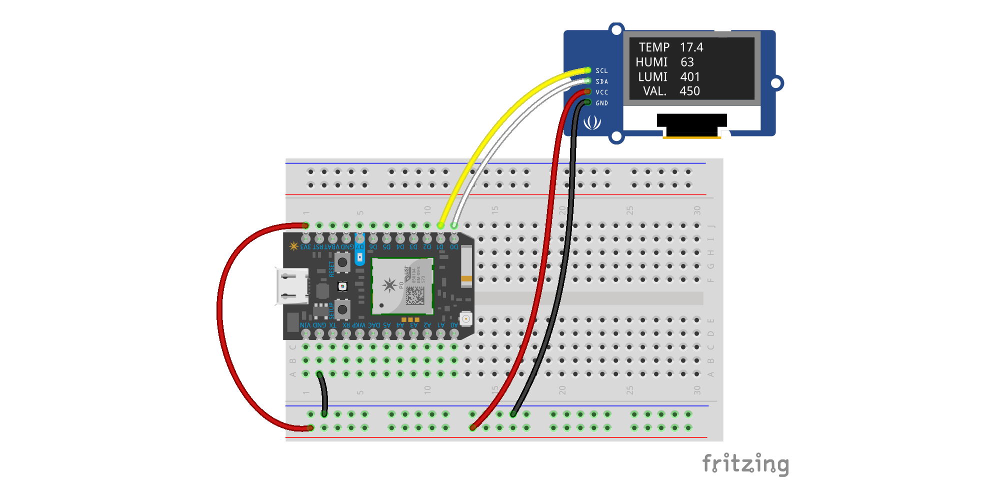

## Récupérer des données du web et les afficher

Récupérer des données JSON renvoyées par une API et les afficher sur un écran OLED en utilisant les *webhooks* proposés par Particle.  



### Mise en place

* télécharger les éléments
* assembler le circuit sur une *breadboard*
* créer un webhook (voir les étapes ci-dessous)
* programmer le photon avec le code
  * saisir le code
  * compiler
  * flasher!


### Données / API
Les données sont fournies par une pseudo API qui renvoie un fichier JSON sous la forme suivante (le fichier PHP utilisé pour renvoyer ce JSON est inclus, il s'agit de test_json.php)
```
   {
     "temperature":19.3,
     "humidite":65,
     "luminosite":624,
     "valeur":123
   }
```
### Récupération des données par *webhook*

#### Créer le *webhook*

Se connecter à la console Particle, dans la partie «integrations», choisir «new integration», puis *WebHook* dans les choix disponibles


#### Configurer le *webhook*


Remplir les champs de la ménière suivante
* Event Name: meteotest
* URL: http://lesporteslogiques.net/outils/test_json.php
* Request Type: GET
* Request Format: Query Parameters
* Device: Any

#### Configurer le traitement des données


Sélectionner «advanced options», dans la partie *Webhook responses*, ajouter le modèle de traitement dans la case «Response Template» :
```
{{{temperature}}}~{{{humidite}}}~{{{luminosite}}}~{{{valeur}}}
```
Ce modèle utilise la syntaxe *[mustache](https://docs.particle.io/reference/device-cloud/webhooks/#variable-substitution)*  

#### Vérifier le *webhook*

Une fois le webhook prêt, on peut envoyer le code, flasher et vérifier dans la console Particle que les données sont bien récupérées.


### Ressources utiles

Fonctions de la classe String
* https://docs.particle.io/reference/device-os/firmware/photon/#string-class

Tutoriel webhooks
* https://docs.particle.io/tutorials/device-cloud/webhooks/

Utiliser le langage de template mustache
* Bons exemples pour commencer https://docs.particle.io/reference/device-cloud/webhooks/#variable-substitution
* Doc. complète : [mustache manual](http://mustache.github.io/mustache.5.html)
