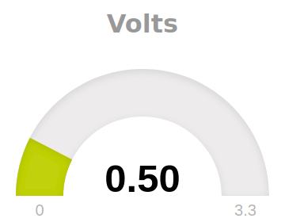
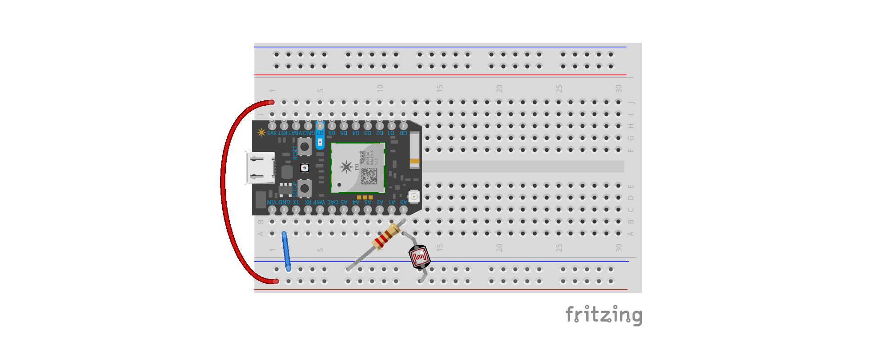

## Affichage dynamique de données avec Photon

Récupérer des données depuis un Photon et les afficher dynamiquement dans une interface web construite avec javascript, sous forme de jauge (en utilisant la bibliothèque justgage).



Les données sont exposées sur le cloud par le Photon en utilisant la fonction Particle.variable();



### Mise en place

* télécharger les éléments
* assembler le circuit sur une *breadboard*
* programmer le photon
  * saisir le code
  * compiler
  * flasher!
* modifier la page interface_web/affichage_dynamique.html
  * modifier la variable deviceId avec i'ID du Photon utilisé
  * modifier l'accessToken avec celui associé au compte utilisateur
* ouvrir la page interface_web/affichage_dynamique.html dans un navigateur

### Débugguer

Si ça ne marche pas du premier coup...

* Pour vérifier que le code fonctionne et que la variable est émise sur le cloud : la console de https://build.particle.io/ permet de voir les *devices* connectés au cloud Particle et d'accéder aux valeurs des variables
* Pour vérifier que l'ordinateur peut se connecter, que les identifiants sont bien renseignés on peut utiliser cURL avec une requête de ce type
```
# 99999999999999 est à remplacer par le device ID du Photon
# 00000000000000 est à remplacer par l'access token du compte
curl -X GET https://api.particle.io/v1/devices/99999999999999/volts?access_token=00000000000000
```
* Pour vérifier que le code javascript fonctionne on peut utiliser la console du navigateur : y a t'il des erreurs ?
* Pour vérifier que le code javascript se déroule correctement, on peut inclure des commandes console.log("message à afficher dans la console");
* Pour vérifier que la page web se met à jour régulièrement, on peut utiliser la console du navigateur, onglet réseau pour voir les requêtes GET envoyées régulièrement.

## Ressources utiles

Bibliothèque Javascript JustGage (affichage de jauge) : https://toorshia.github.io/justgage/
