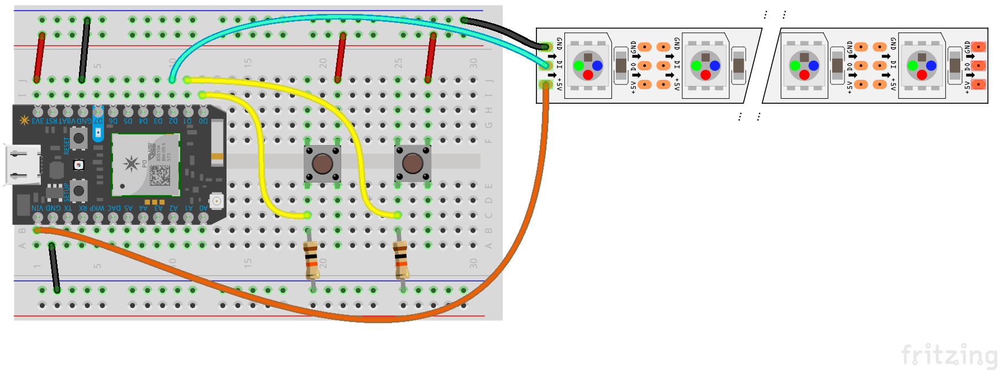
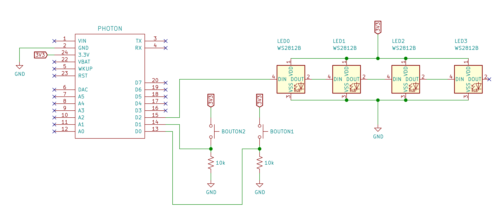

Définir la couleur d'un ruban de LEDs à distance depuis une interface web qui permet de choisir la couleur. Deux boutons sont intégrés au circuit pour le tester : le premier bouton change aléatoirement les couleurs de chaque LED, le second éteint toutes les LEDs du ruban.

* télécharger les éléments
* assembler le circuit sur une *breadboard*
* programmer le photon
  * saisir le code
  * ajouter la *library* neopixel
  * compiler
  * flasher!
  * tester avec les boutons
* modifier la page interface_web/couleur.html 
  * modifier la variable deviceId avec i'ID du Photon utilisé
  * modifier l'accessToken avec celui associé au compte utilisateur
* ouvrir la page interface_web/couleur.html dans un navigateur

