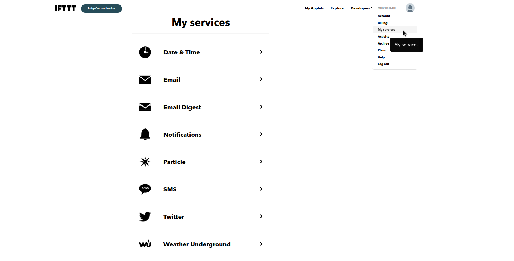
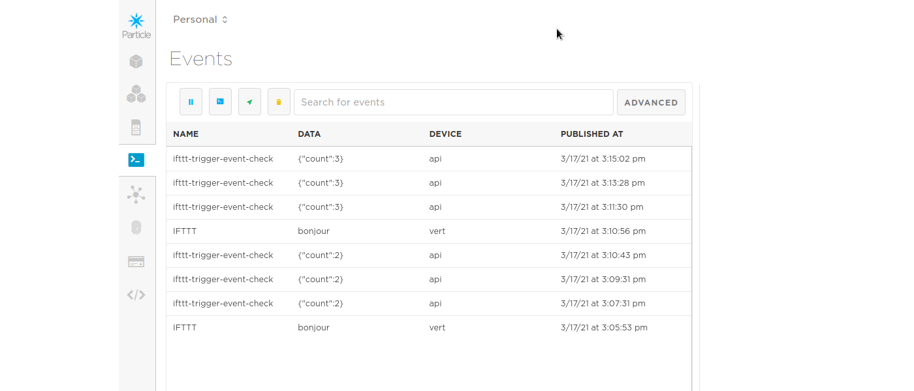

## Déclencher un évènement distant avec un bouton et IFTTT

Appuyer sur un bouton pour envoyer un tweet. Cet exemple montre comment utiliser la fonction Particle.publish pour publier un évènement relié à la plateforme IFTTT. IFTTT permet à partir d'un évènement de déclencher un autre service web (par exemple : spotify, telegram, twitch, twitter, vimeo et des dizaines d'autres).  
Il est également possible de déclencher l'envoi d'un SMS (limité à 10 SMS par mois pour l'Europe)

A noter : twitter ne relaie des messages que si leur contenu diffère (ajouter la date permet de contourner ce problème)

### Mise en place

* télécharger les éléments
* assembler le circuit sur une *breadboard*
* si nécessaire, créer un compte sur https://ifttt.com/ (un compte permet de créer 3 applets gratuitement)
* sur IFTTT, configurer l'autorisation d'accès au compte twitter (voir ci-dessous)
* sur IFTTT, associer le compte Particle, procédure du même type que pour le  compte twitter
* programmer l'applet IFTTT (voir ci-dessous)
* programmer le photon avec le code
  * saisir le code
  * compiler
  * flasher!
* vérifier que le bouton déclenche l'évènement (voir ci-dessous)

### Configurer l'autorisation d'accès au compte twitter

Choisir «My services» dans le menu ( https://ifttt.com/my_services )

### Création de l'applet IFTTT

1. Démarrer un nouvel applet avec «create», puis configurer d'abord la partie «if  this»

2. Choisir le service «Particle»

3. Choisir le type d'évènement «New event published»

4. Renseigner le nom de votre évènement, le contenu de l'évènement et le nom du Photon

5. Configurer ensuite la partie «Then That»

6. Définir le message à envoyer sur twitter, on peut utiliser des éléments de modèle qui seront remplacés par l'évènement

7. Valider l'ensemble et c'est prêt!

### Vérifier que le bouton déclenche l'évènement

Une fois tout en place, il est possible de vérifier que l'évènement est bien envoyé sur le cloud en utilisant la console Particle ( https://console.particle.io/ ) :

